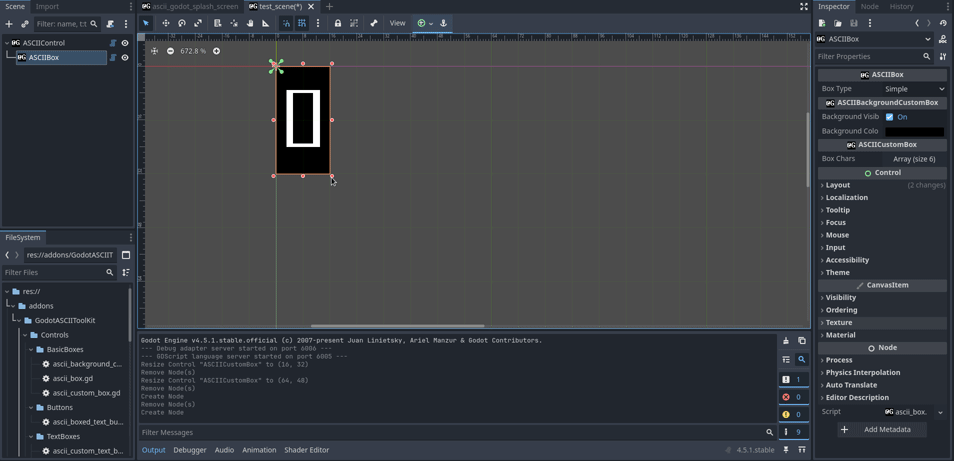
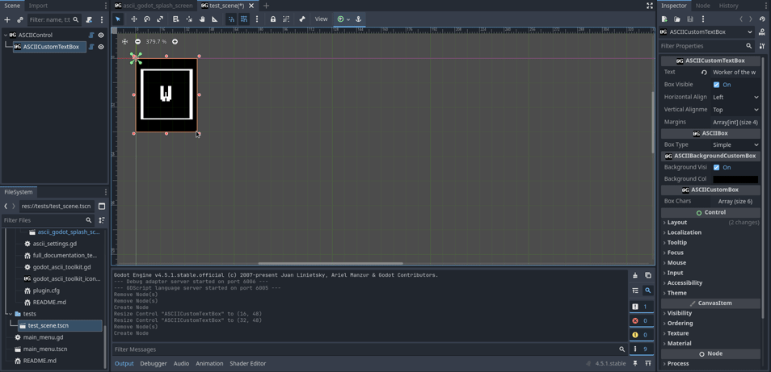
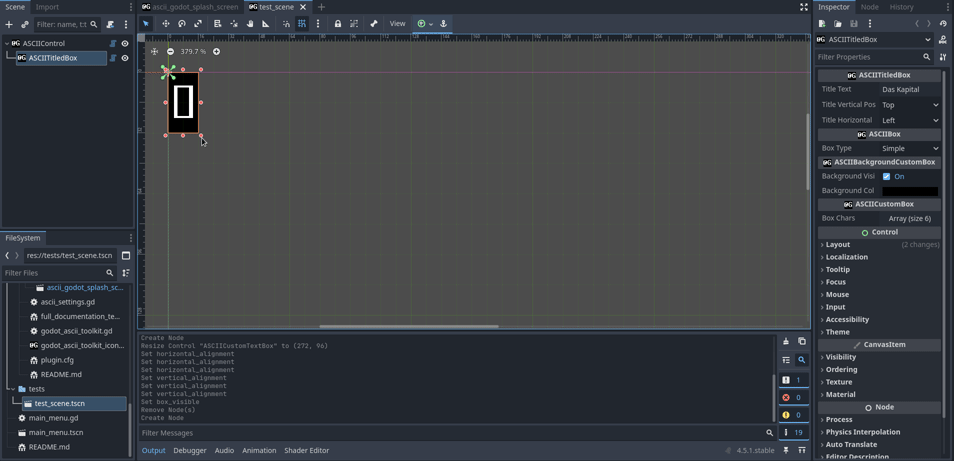

# Godot ASCII ToolKit

**An open source ASCII toolkit for Godot!**

## License

MIT (*cf.* [LICENSE file](LICENSE)). 

## Principle

As mentioned in [this README](../../README.md), the idea is to develop a tool for creating ASCII games while making the most of Godot's features, especially: 
- WYSIWYG editor,
- signal handling,
- animation players.

So I created tools scripts to mimick the behavior of some control nodes in Godot. To do that, I relied mainly on the Label node. I made a custom version of it called `ASCIILabel` loading a custom theme ([`ascii_label_theme.tres`](Resources/Godot/Themes/)) which basically ensure that the Font is [Mx437_IBM_VGA_8x16](Resources/Font/), with correct size of 16 and no line spacing. From that, I build on top to make boxes, text boxes, buttons, *etc.*

I am not sure it is a good idea, so please feel free to share your objections and throught with me in the issues section.

## Generalities

- Default Font size is 8x16 (in pixels).
- Default viewport size is 1280x720 in pixels (meaning 160 columns and 45 lines).
- The tools are **designed to be used with grid snapping on** (the grid must be 8x16). I do not know how to configure this from gdscript, so it has to be done manually in the editor for now. 
- All custom types added by the plugin have their names begin with `ASCII`.

## Godot ASCII Splash

I made a Godot ASCII splash screen which replace the original one by default. 


## ASCIISettings

There is an autoload when the plugin is activated : [`ASCIISettings`](ascii_settings.gd). This is where you can:
- change the game resolution and grid size with enums `TILE_SIZE_PX` and `VIEWPORT_SIZE_PX` (`ProjectSettings` are changed accordingly),
- toggle on or off the Godot ASCII Splash Screen with enum `SPLASH`,
- The scene after the Godot ASCII Splash Screen with enum `SCENE_AFTER_SPLASH`.

This script also changes some `ProjectSettings`:
- "application/boot_splash/image" -> `false`: to replace the original splash by the ASCII one.
- "rendering/textures/canvas_textures/default_texture_filter" −> 0: so that the rendering of pixel font in the editor is set to nearest (default is linear).

Maybe it would be simpler if all those configurations were handled through text files? Please, don't hesitate to give feedbacks. 

## List of custom types

(*parenthesis indicate inheritance*)

- `ASCIILabel(Label)`: Just a label with the good properties for ASCII tools.
- `ASCIIControl(Control)`: Specialization class of Control for ASCII grids.
- `ASCIICustomBox(ASCIIControl)`: A specialized `ASCIIControl` containing a `ASCIILabel` to draw boxes. Box characters are customizable.
- `ASCIIBackgroundCustomBox(ASCIICustomBox)`: `ASCIICustomBox` with a solid background.
- `ASCIIBox(ASCIIBackgroundCustomBox)`: ASCII Box where the box characters are chosen from a list of types.



- `ASCIICustomTextBox(ASCIIBox)`: ASCII text box with custom margins



- `ASCIITitledBox(ASCIIBox)`: A box with a title on the frame.



- `ASCIIBoxedTextButton(ASCIICustomTextBox)`: ASCII looking button with text and framebox.


## Documentation

Every custom type is documented using the following the template describe in file [full_documentation_template.txt](full_documentation_template.txt)

``` gdscript
## Script type #################################################################
## Description -----------------------------------------------------------------
##
## Statics ---------------------------------------------------------------------
##
## Enums -----------------------------------------------------------------------
##
## Exported properties ---------------------------------------------------------
##
## Internal properties ---------------------------------------------------------
## 
## Signals ---------------------------------------------------------------------
##
## Nodes created ---------------------------------------------------------------
##
## Comments --------------------------------------------------------------------
## 
## Author(s) -------------------------------------------------------------------
##
################################################################################
```

I will try to document functions more exhaustively.

## Very precise Godot questions: can you help?

- How can I configure grid size and activate grid snap in the 2D editor through gdscript? I know about [EditorSettings](https://docs.godotengine.org/en/stable/classes/class_editorsettings.html), but it does not seem to include it... Other "solutions" I found were more like messy workaround and, when you have to do things like that, it usually means that you've missed something (at least in my own experience).
- I am really confused about themes. I didn't manage to create it from script, so I have to rely on a ressource created from the editor... If someone knows, please show me in the [`ASCIILabel`](Controls/ascii_label.gd).

## Contributing

As long as they are properly documented and respect [gdscript styling](https://docs.godotengine.org/en/stable/tutorials/scripting/gdscript/gdscript_styleguide.html), all contributions are welcome!

## Ask for help or new features

Do not hesitate to ask, I know I am not always clear in my explanations. Also, it is always nice to have feedbacks from users to enhance the tool! :) 
